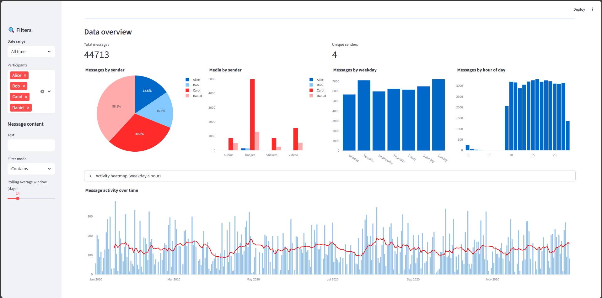

# WhatsApp Chat Analyzer

A data-driven WhatsApp chat analysis tool built with **Python + Streamlit**, designed to extract insights from exported conversations — message distribution, participation dynamics, media usage, and conversational structure.




It parses exported `.txt` conversations and generates structured insights about:
- Participation patterns
- Message distribution over time
- Media usage
- Activity heatmaps
- Conversation dynamics
## Try It Online (Safe Demo)

**Live Demo (Sample Chat Only)**  
[Streamlit Cloud Link Here](https://chronochat.streamlit.app/)

The online version only allows using a built-in sample chat.  No personal data can be uploaded.

Use the **“Try default sample chat”** or **“Generate new sample chat”** buttons to explore the app without uploading your own chat.

## Analyze Your Own Chat (Local Only)

To analyze your own WhatsApp export:

```bash
git clone https://github.com/Jaboaro/whatsapp-chat-analyzer.git
cd whatsapp-chat-analyzer
pip install -r requirements.txt
streamlit run app/app.py
```
All processing happens locally on your machine.
Your chat data never leaves your computer.

## What It Does

-   Parses WhatsApp exported `.txt` files
    
-   Supports **English** and **Spanish** formats
    
-   Handles **multi-line messages**, **media placeholders**, and **quoted replies**
    
-   Generates structured datasets for analysis
-   Visualizes:
    -   Messages over time
    -   Messages per participant
    -   Activity by hour/day
    -   Media usage statistics
        
## Core Features

### Message Analytics

-   Messages per user
-   Daily & weekly activity trends
-   Hour-of-day distribution
-   Conversation bursts & gaps
    

### Media Insights

-   Media type distribution
-   Media per participant
-   Text vs media ratio
    

### Testing & Simulation

-   Deterministic synthetic chat generation
-   Seed-based reproducibility
-   Heterogeneous user behavior modeling
    


## Architecture Highlights

-   **Clean layering:** Parsing → Structured Data → Analysis → Visualization → UI
-   **Thin UI philosophy:** Streamlit handles interface only
-   **Locale-aware parsing:** Export profiles (EN/ES) for date and media formats
-   **Auxiliary tool:** Synthetic chat generator for testing or demo data (`tools/chat_generator`)
    


## Installation

```bash
git clone https://github.com/Jaboaro/whatsapp-chat-analyzer.git
cd whatsapp-chat-analyzer
pip install -r requirements.txt
streamlit run app/app.py
```


## Demo


## About disabled cloud features
Uploading your own chats is disabled in the Streamlit Cloud version.
WhatsApp chats may contain sensitive information involving third parties, so they are not sent to external servers. To access all features, please use the local version available on GitHub.


## Technical Documentation

For architecture details, design decisions, and internal structure:

See [TECHNICAL README](TECHNICAL_README.md)


